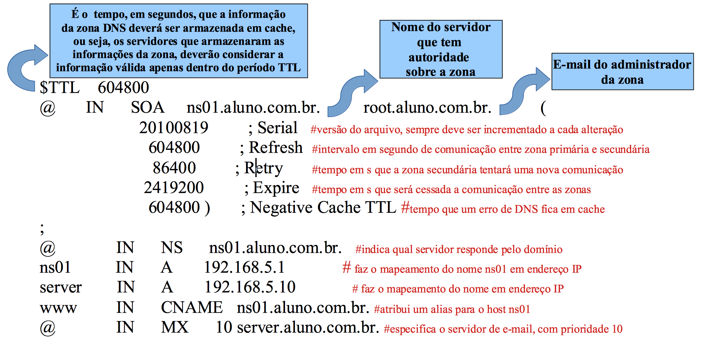
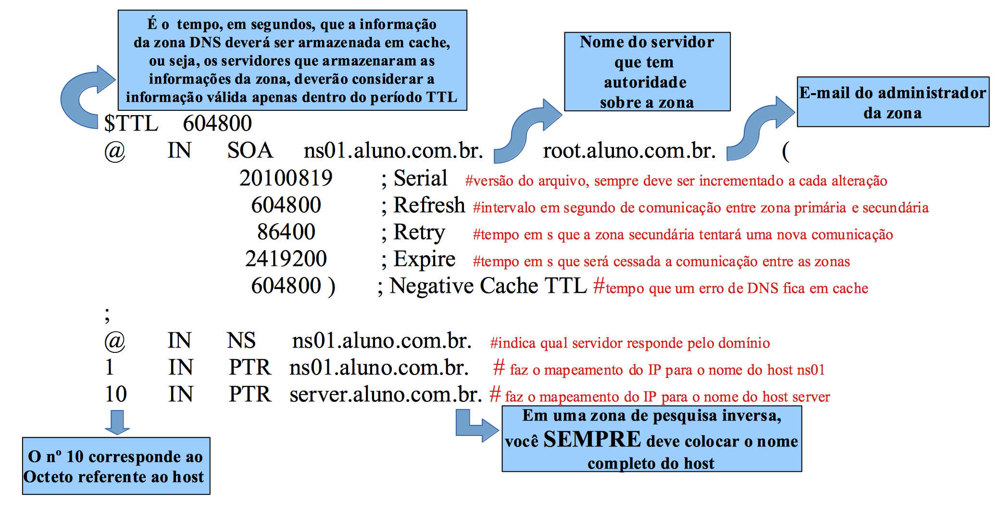

# MANUAL DE CONFIGURAÇÃO DNS #

<h2 align="middle">INSTALAÇÃO E CONFIGURAÇÃO</h2>

O servidor DNS é responsável por fazer a tradução de nomes em endereços IP e endereço IP em nomes, caso você possua uma conexão com a internet e não tenha um DNS o acesso a algum site  só seria possível se o usuário digitasse o endereço IP do referido site no navegador, daí a grande importância deste serviço para uma rede.

Para que uma empresa tenha um DNS um pré-requisito é que ela possua um IP válido e fixo, e ainda possua o domínio disponível, para isso deve realizar uma pesquisa se o domínio desejado está disponível no endereço http://registro.br/index.html, após realizar a configuração deste domínio no servidor DNS o administrador pode realizar um cadastro no site citado e pagar um valor anual de R$ 40,00.

O servidor para o protocolo DNS mais utilizado no linux é o BIND (Berkeley Internet Name Domain) que encontra-se em sua versão 9 para instalação deste programa na distribuição debian acesse o shell como root e digite o comando abaixo:
<h4 align="middle">apt-get install bind9</h2>

O apt irá baixar o bind  e as dependências necessárias e instalar no Linux, após a instalação será criado um diretório localizado no /etc/bind, o arquivo de configuração principal é o named.conf, é nele que encontram-se as zonas dos servidores raízes e localhost, o arquivo db.root  é o arquivo de registro que descreve o servidor de nomes raiz no mundo e, ainda o named.conf.local que é o arquivo onde são criadas as zonas configuradas pelo administrador do sistema.

Neste nosso manual iremos configurar no Bind uma zona de pesquisa direta e inversa conforme descrição abaixo:

 * Nome da zona: aluno.com.br
 * Servidor de nomes: será chamado ns01 que é o seu computador
 * Servidor de e-mail: será chamado server e possui o ip 192.168.5.10
 * O host ns01 responderá pelo nome www

 Antes de configurar propriamente dito o Bind deveremos informar para o nosso computador quem será o servidor DNS, para isso alteraremos o arquivo /etc/resolv.conf colocando conforme  linha abaixo:
 
 <B>nameserver 192.168.5.1        # que é o IP do nosso computador</B>
 
 
<h2 align="middle">Configuração da Zona de Pesquisa Direta</h2>

A zona de pesquisa direta tem como função traduzir nomes em endereço IP, para criação da  zona aluno.com.br deveremos editar o arquivo named.conf.local localizado no diretório /etc/bind, conforme sequencia descrita a seguir:

* Acesse o Diretório com o comando cd /etc/bind
* Abra o arquivo named.conf.local com o comando nano named.conf.local
* Edite o arquivo named.conf.local conforme descrição abaixo:

<h2 align="middle">Criação do Arquivo de Registro da Zona de Pesquisa Direta</h2>

Para criação do arquivo db.aluno.com.br aproveitaremos a estrutura de um arquivo já existente, no nosso exemplo utilizaremos o db.local, desta forma realizaremos uma cópia do mesmo, só lembrando que para isso você deverá está no diretório /etc/bind

<h4 align="middle">cp db.local db.aluno.com.br</h4>

Após a realização da cópia abra o arquivo db.aluno.com.br com um editor de sua preferência (comando: nano db.aluno.com.br) e altere conforme descrição abaixo:

Salve o arquivo e reinicie o serviço com o comando abaixo:

 <h4 align="middle">/etc/init.d/bind9 restart</h2>
 
<h2 align="middle">Realizando os testes da Zona de Pesquisa Direta</h2>
 
Nas distribuições baseadas no debian existe um aplicativos para testes que se chama nslookup, para verificar se seus registros estão corretos digite no shell o comando nslookup e o nome ou ip do computador, esta última opção para verificar a zona de pesquisa inversa.

Geralmente os primeiros testes são a verificação do servidor de nomes,  para isto devemos acrescentar uma opção no comando nslookup conforme descreverei abaixo:
 

 

<h2 align="middle">Configurando uma Zona de Pesquisa Inversa</h2>

A zona de pesquisa inversa tem a função de traduzir endereço IP para nome, as zonas de pesquisa inversa podem ser necessárias para certos aplicativos seguros que exigem a validação de endereços IP. Para criarmos uma zona de pesquisa inversa sempre utilizaremos o mesmo arquivo de configuração de zona que é o <b>named.conf.local</b>, lembrando que foi o mesmo arquivo que você configurou a zona de pesquisa direta aluno.com.br, abra o arquivo named.conf.local localizado no diretório <b>/etc/bind</b>, e deixe-o conforme abaixo:

<h4 align="middle">Criação do Arquivo de Registro da Zona de Pesquisa</h4>

Para criação do arquivo db.5.168.192 aproveitaremos a estrutura do arquivo db.aluno.com.br, já que o arquivo de registro da zona de pesquisa inversa possui o mesmo cabeçalho, desta forma realizaremos uma cópia do mesmo, só lembrando que para isso você deverá está no diretório /etc/bind

<h5 align="middle">cp db.aluno.com.br db.5.168.192</h5>

Após a realização da cópia abra o arquivo db.5.168.192 com um editor de sua preferência e altere conforme descrição abaixo:

<h4 align="middle">Realizando os testes da Zona de Pesquisa Inversa</h4>
Para realizar os testes na zona de pesquisa inversa basta digitar o IP do host cadastrando na zona de pesquisa inversa após o comando nslookup, conforme exemplo abaixo:

