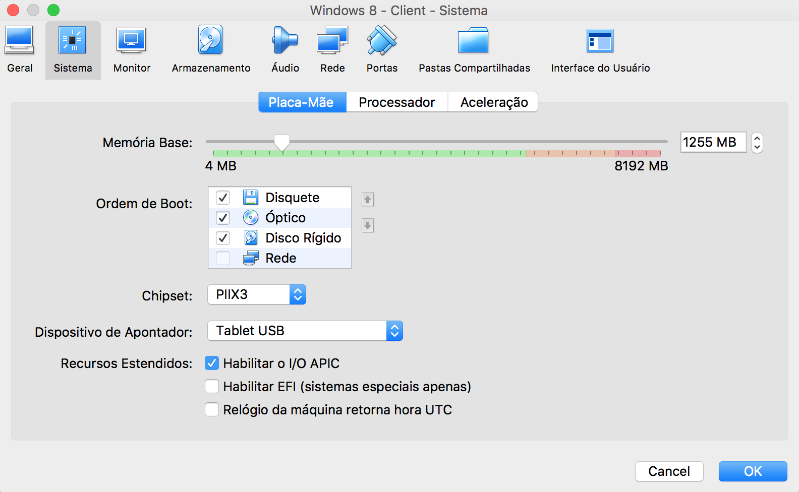
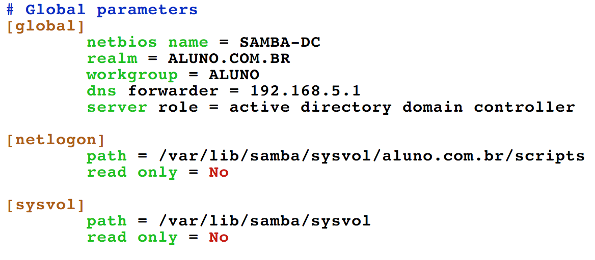
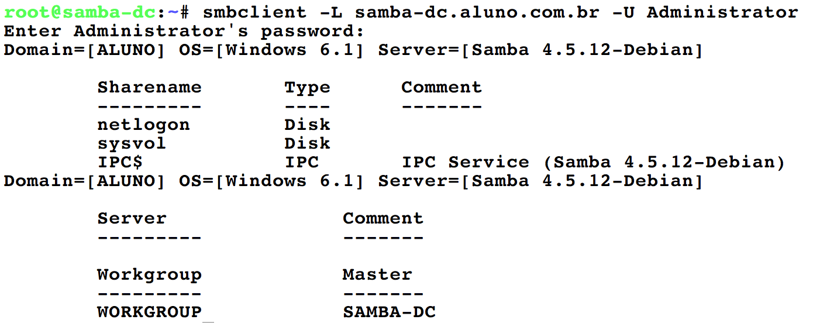

# SERVIÇO SAMBA

O Samba é um serviço disponível para Sistemas Operacionais Linux que permite compartilhar diretórios e impressoras, bem como implementar um controlador de domínio. A primeira versão do Samba, foi disponibilizada em 1992, e escrita por Andrew Tridgell, um Australiano que na época era estudante de ciências da computação, atualmente encontra-se em sua versão 4, a grande novidade desta versão são as implementações de Diretivas de Grupos. Para o seu funcionamento necessita da instalação dos seguintes pacotes:

 * <b>Samba</b> – Que disponibiliza o samba propriamente dito;
 * <b>Kerberos</b> – Protocolo desenvolvido para prover altenticação em aplicações e serviços cliente/servidor;
 * <b>Winbind</b> -  Proporciona uma integração de usuários Windows com o samba;
 * <b>Smbclient</b> – Permite acessar compartilhamentos em outras máquinas.

Para que você possa configurar um ambiente totalmente funcional com controlador de domínio samba, ferramenta de administração do Samba RSAT e um cliente para o teste criei um Appliance no endereço:

Este Appliance terá um servidor Samba <b>samba-dc</b>, um cliente para administrar graficamente o Samba a máquina <b>RSAT-PC</b>, no diretório c:\samba encontra-se o instalador, e a máquina <b>Cliente-PC</b>, para testes com o cliente, conforme diagrama abaixo:

<h4 align="middle">Figura 01 - Diagrama de Rede</h4>

Conforme apresentado no diagrama de rede acima Fig. 01 o ip da interface <b>enp0s3</b> é 192.168.5.1, a senha tanto do usuário <b>root</b> como do usuário <b>aluno</b> é <b>123456</b>

É importante pontuar que a memória reservada para as máquinas virtuais foram de 1255 MB, todavia podendo diminuir este tamanho conforme configuração máquina que estará executando o appliance, podemos observar a alocação de memória deseja na Fig. 02.

<h4 align="middle">Figura 02 - Alocação de Memória VM</h4>

## INSTALAÇÃO SAMBA

Para instalação do Samba devemos baixar os pacotes: samba, kerbero, smbcliente e winbind, conforme comando a seguir:

<h4 align="middle">apt-get install samba krb5-config winbind smbclient</h4>

Ao final da instalação é solicitado informações sobre configuração do kerberos, a primeira tela Fig. 03, solicita qual o nome do domínio, onde configuraremos aluno.com.br.

<h4 align="middle">Figura 03 - Realm Kerberos</h4>

Será solicitado também o ip do servidor responsável pelo domínio, iremos configurar o endereço loopback, já que o kerberos está sendo executado no mesmo host do samba:

<h4 align="middle">Figura 04 - Servidor Kerberos</h4>

E ainda é solictado o ip do servidor administrativo que também será o endereço loopback, conforme explicações anteriores:

<h4 align="middle">Figura 05 - Servidor Administrativo</h4>

Ao concluir a instalação devemos renomear o arquivo principal de configuração do samba o <b>smb.conf</b>, para que ao aprovisionar o domínio, seja gerado um novo smb.conf, de acordo com o comando a seguir:

<h4 align="middle">cp /etc/samba/smb.conf /etc/samba/smb.conf.original</h4>

O passo seguinte deveremos configurar o samba como controlador de domínio, é importante pontuar que o nome do nosso domínio será <b>aluno.com.br</b> e o nome da máquina q está executando o samba é <b>samba-dc</b>, através do comando <b>samba-tool</b> conforme apesentado na Fig. 06:

<h4 align="middle">Figura 06 - Comando samba-tool</h4>

Onde você informará qual realm do domínio, em nosso exemplo <b>aluno.com.br</b>, qual o domain, o mondo como o serviço samba está operando, se <b>DC</b> como controlador de domínio ou <b>standalone</b> somente para compartilhamento de arquivos, qual tipo de dns estará fazendo a resolução de nomes, em nosso exemplo estaremos utilizando o do próprio samba <b>SAMBA_INTERNAL</b> e qual endereço do dns estará redirecionando as solicitações de resolução de nome. Responda todas estas perguntas conforme Fig. 06.

Ao concluir a configuração será gerado um novo smb.conf bem como o arquivo de configuração do kerberos e apresetnado um relatório conforme Fig. 07:

<h4 align="middle">Figura 07 - domain_provision</h4>

O arquivo smb.conf gerado no comando <b>samba-tool domain provision</b> é apresentado na Fig. 08 e corresponde a configuração inicial do samba:

<h4 align="middle">Figura 08 - Arquivo smb.conf</h4>

Ao concluir toda a configuração podemos fazer um teste no samba utilizando o smbcliente conforme apresentado na Fig. 09

<h4 align="middle">Figura 09 - Teste Samba</h4>

Faz-se necessário copiar o arquivo gerado pelo kerberos durante o aprovisionamento do domínio para a pasta <b>etc</b>:

<h4 align="middle">cp /var/lib/samba/private/krb5.conf /etc/</h4>

O administrador do sistema deverá derrubar todos os serviços do samba, objetivando alterar configurações, conforme comando abaixo:

<h4 align="middle">systemctl stop smbd.service nmbd.service winbind.service </h4>

Devemos desativar todos os serviços do samba para não serem iniciados no boot, impossibilitando o AD de subir:

<h4 align="middle">systemctl disable smbd.service nmbd.service winbind.service</h4>

O serviço samba-ad-dc ao ser instalado ele vem mascarado, desta forma o mesmo é impedido de ser iniciado ou parado, para que possamos parar o iniciar o serviço manualmente devemos desmascarar o samba com o comando:

<h4 align="middle">systemctl unmask samba-ad-dc.service</h4>

Como o samba-dc-ad foi parado anteriormente devemos inicializá-lo:

<h4 align="middle">systemctl start samba-ad-dc.service </h4>

Habilite com o comando abaixo, o serviço samba-ad-dc para inicializar no boot:

<h4 align="middle"><b>systemctl enable samba-ad-dc.service</b></h4>

Podemos ainda tirar a complexidade da senha usando o samba-tool, conforme apresentado na Fig. 10

<h4 align="middle">Figura 10 - Alteração Complexidade de Senha</h4>

Caso o administrador de rede deseje, pode especificar o tamanho mínimo de uma senha, na Fig. 11, configuramos que o usuário tenha uma senha como no mínimo 6 caracteres ou símbolos

<h4 align="middle">Figura 11 - Tamanho da Senha</h4>

##CONFIGURAÇÃO DO RSAT
## DIAGRAMA DE REDE

O serviço samba pode ser administrado diretamente no host em que está instalado o serviço, através do seu arquivo de configuração e o utilitário <b>samba-tool</b> 
