# SERVIÇO SAMBA

O Samba é um serviço disponível para Sistemas Operacionais Linux que permite compartilhar diretórios e impressoras, bem como implementar um controlador de domínio. A primeira versão do Samba foi disponibilizada em 1992, e escrita por Andrew Tridgell, um Australiano que na época era estudante de ciências da computação, atualmente encontra-se em sua versão 4, a grande novidade desta versão são as implementações de Diretivas de Grupos. Para o seu funcionamento necessita da instalação dos seguintes pacotes:

*  <b>Samba</b> – Que disponibiliza o samba propriamente dito;

* <b>Kerberos</b> – Protocolo desenvolvido para prover altenticação em aplicações e serviços cliente/servidor;

* <b>Winbind</b> -  Proporciona uma integração de usuários Windows com o samba;

* <b>Smbclient</b> – Permite acessar compartilhamentos em outras máquinas.

Para que você possa configurar um ambiente totalmente funcional com controlador de domínio samba, ferramenta de administração do Samba RSAT e um cliente para o teste, criei um Appliance no endereço:

https://drive.google.com/open?id=1k_6UyI9RjKqrBUSAVVpLnftYZu6_9aI7

Este Appliance terá um servidor Samba <b>samba-dc</b>, um cliente para administrar graficamente o Samba a máquina <b>RSAT-PC</b>, no diretório c:\samba encontra-se o instalador, e a máquina <b>Cliente-PC</b>, para testes com o cliente, conforme diagrama abaixo:

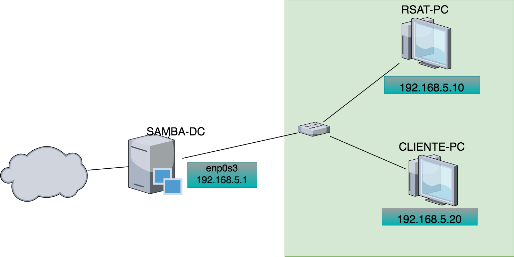
<h4 align="middle">Figura 01 - Diagrama de Rede</h4>

Conforme apresentado no diagrama de rede acima Fig. 01 o IP da interface <b>enp0s3</b> é 192.168.5.1, a senha tanto do usuário <b>root</b> como do usuário <b>aluno</b> é <b>123456</b>

É importante pontuar que a memória reservada para as máquinas virtuais foram de 1255 MB, todavia podendo diminuir este tamanho, conforme configuração da máquina que estará executando o Appliance. Podemos observar a alocação de memória desejada na Fig. 02.

<h4 align="middle">Figura 02 - Alocação de Memória VM</h4>

## INSTALAÇÃO SAMBA

Para instalação do Samba devemos baixar os pacotes: samba, kerbero, smbcliente e winbind, conforme comando a seguir:

**<h4 align="middle">apt-get install samba krb5-config winbind smbclient</h4>**

Ao final da instalação são solicitadas informações sobre configuração do kerbero. A primeira tela Fig. 03, solicita qual o nome do domínio, o qual configuraremos <b>aluno.com.br</b>.

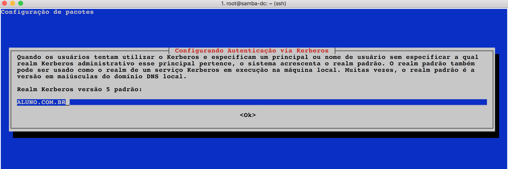
<h4 align="middle">Figura 03 - Realm Kerberos</h4>

Será solicitado também o IP do servidor responsável pelo domínio. Iremos configurar o endereço loopback, já que o kerberos está sendo executado no mesmo host do samba:

<h4 align="middle">Figura 04 - Servidor Kerberos</h4>

E ainda é solictado o ip do servidor administrativo que também será o endereço loopback, conforme explicações anteriores:

<h4 align="middle">Figura 05 - Servidor Administrativo</h4>

Ao concluir a instalação devemos renomear o arquivo principal de configuração do samba o <b>smb.conf</b>, para que ao aprovisionar o domínio, seja gerado um novo smb.conf, de acordo com o comando a seguir:

<h4 align="middle">mv /etc/samba/smb.conf /etc/samba/smb.conf.original</h4>

O passo seguinte deveremos configurar o samba como controlador de domínio, é importante pontuar que o nome do nosso domínio será <b>aluno.com.br</b> e o nome da máquina q está executando o samba é <b>samba-dc</b>, através do comando <b>samba-tool</b> conforme apesentado na Fig. 06:

<b>IMPORTANTE: A senha cadastrada deve possuir um nível alto de complexidade, use número, letras e símbolos, caso coloque uma senha simples dará um erro no final da instalação</b>

<h4 align="middle">Figura 06 - Comando samba-tool</h4>

Onde você informará qual realm do domínio, em nosso exemplo <b>aluno.com.br</b>, qual o domain, o modo como o serviço samba está operando, se <b>DC</b> como controlador de domínio ou <b>standalone</b> somente para compartilhamento de arquivos, qual tipo de dns estará fazendo a resolução de nomes, em nosso exemplo estaremos utilizando o do próprio samba <b>SAMBA_INTERNAL</b> e qual endereço do dns estará redirecionando as solicitações de resolução de nome. Responda todas estas perguntas conforme Fig. 06.

Ao concluir a configuração será gerado um novo smb.conf bem como o arquivo de configuração do kerberos e apresetnado um relatório conforme Fig. 07:

<h4 align="middle">Figura 07 - domain_provision</h4>

O arquivo smb.conf gerado no comando <b>samba-tool domain provision</b> é apresentado na Fig. 08 e corresponde a configuração inicial do samba:

<h4 align="middle">Figura 08 - Arquivo smb.conf</h4>

Ao concluir  toda a  configuração  podemos  fazer um teste no samba utilizando o  smbcliente, conforme apresentado na Fig. 09

<h4 align="middle">Figura 09 - Teste Samba</h4>

Faz-se necessário copiar o arquivo gerado pelo kerberos durante o aprovisionamento do domínio para a pasta <b>etc</b>:

<h4 align="middle">mv /var/lib/samba/private/krb5.conf /etc/</h4>

O administrador do sistema deverá derrubar todos os serviços do samba, objetivando alterar configurações, conforme comando abaixo:

<h4 align="middle">systemctl stop smbd.service nmbd.service winbind.service </h4>

Devemos desativar todos os serviços do samba para não serem iniciados no boot, impossibilitando o AD de subir:

<h4 align="middle">systemctl disable smbd.service nmbd.service winbind.service</h4>

O serviço samba-ad-dc ao ser instalado ele vem mascarado, desta forma o mesmo é impedido de ser iniciado ou parado, para que possamos parar ou iniciar o serviço manualmente devemos desmascarar o samba com o comando:

<h4 align="middle">systemctl unmask samba-ad-dc.service</h4>

Como o samba-dc-ad foi parado anteriormente, devemos inicializá-lo:

<h4 align="middle">systemctl start samba-ad-dc.service </h4>

Habilite com o comando abaixo o serviço samba-ad-dc para inicializar no boot:

<h4 align="middle"><b>systemctl enable samba-ad-dc.service</b></h4>

Podemos ainda tirar a complexidade da senha usando o samba-tool, conforme apresentado na Fig. 10:

<h4 align="middle">Figura 10 - Alteração Complexidade de Senha</h4>

Caso o administrador de rede deseje, pode especificar o tamanho mínimo de uma senha, na Fig. 11, configuramos que o usuário tenha uma senha como no mínimo 6 caracteres ou símbolos

<h4 align="middle">Figura 11 - Tamanho da Senha</h4>

## CONFIGURAÇÃO DO RSAT

O serviço samba pode ser administrado diretamente no host em que está instalado o serviço, ou podemos administrá-lo remotamente por meio do software RSAT instalado em um computador com sistema operacional Windows que esteja previamente autenticado no domínio. Você verá que a configuração passa a ser igual a do Windows Server. Em nosso diagrama (Fig. 01), iremos administrar o samba a partir do host RSAT-PC, que tem o IP 192.168.5.10.

Antes de instalar o <b>RSAT</b> devemos ingressar o host no domínio. Acesse o painel de controle e vá em sistemas em segurança => sistemas, será exibido uma janela conforme Fig. 12:

<h4 align="middle">Figura 12 - Sistemas</h4>

Na área de configurações de grupo de trabalho clique em alterar configurações, no qual será exibido a janela de propriedades do sistemas (Fig. 13). Clique no botão <b>Alterar</b> para informar o domínio que devemos ingressar.

<h4 align="middle">Figura 13 - Propiedades do Sistemas</h4>

Na janela de alterações do domínio (Fig. 14), você terá a posibilidade de alterar o domínio e o nome do computador. Marque o item domínio e coloqueo o nome <b>aluno</b>.

<h4 align="middle">Figura 14 - Alteração de Domínio</h4>

Ao alterarmos o domínio, será solicitado um usuário e senha para ingressar no domínio. O usuário é o <b>Administrator</b> e a senha é a cadastrada quando foi aprovisionado o domínio (Fig. 15).

<h4 align="middle">Figura 15 - Senha Domínio</h4>

Se a configuração feita no samba estiver toda correta, será apresentada uma janela de confirmação, dando boas vindas ao domínio, Fig. 16.

<h4 align="middle">Figura 16 - Confirmação Domínio</h4>

Conforme abordado anteriormente, deve-se instalar o RSAT somente depois que o host fizer parte do domínio, no Appliance disponilizado, o instalador do RSAT está localizado em <b>c:\samba</b>, Fig. 17. Faça a instação do mesmo.

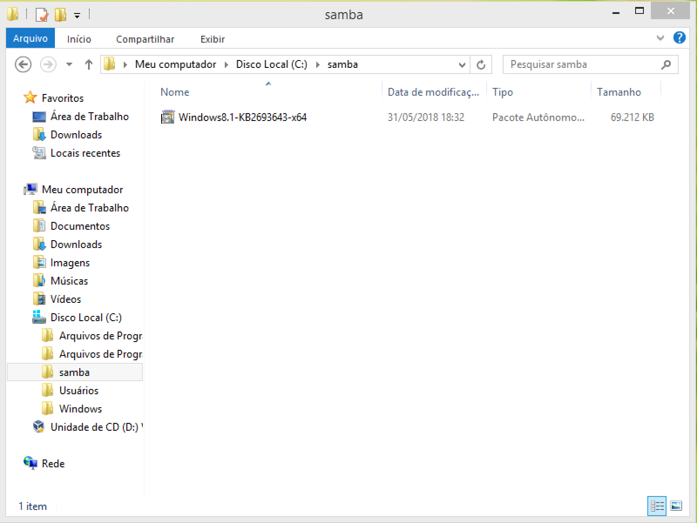
<h4 align="middle">Figura 17 - Diretório Instalador RSAT</h4>

Ao concluir a instalação, será criado um item no menu iniciar <b>Ferramentas Administrativa</b> (Fig. 18), que possuirá várias ferrametas para administração do domínio.
 

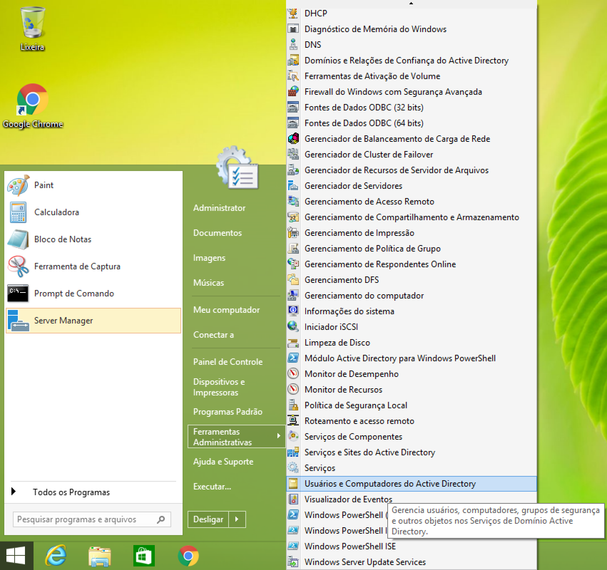
<h4 align="middle">Figura 18 - Ferramentas Administrativas</h4>

A primeira configuração a ser relizada é referente aos usuários. Selecione o item Usuários e Computadores do Active Directory, no qual abrirá uma janela para administração de usuário e unidades organizacionais (Fig. 19).

As Unidades Organizacionais-OU são contêineres que armazenam informações sobre usuários e computadores. Em nosso exemplo iremos criar uma OU para armazenar nossos novos usuários a serem criados. Para isso clique com o botão direito em cima do nome do domínio, selecione no menu suspenso o item Novo => Unidade organizacional.

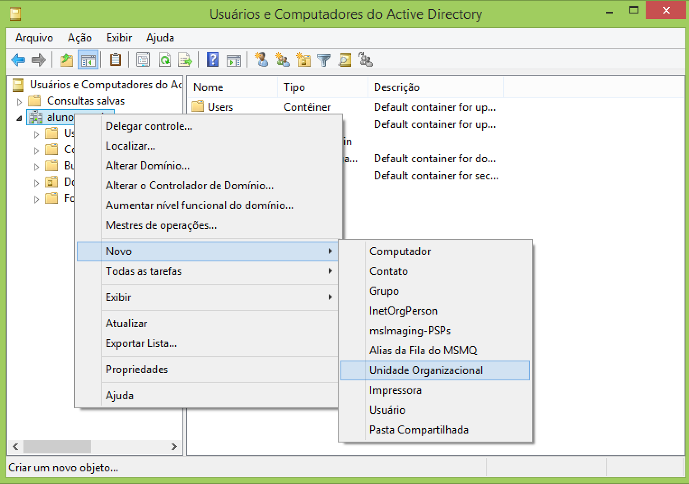
<h4 align="middle">Figura 19 - Usuários e Computadores do AD</h4>

Vamos criar uma Unidade Organizacional chamada nassau, desmarque a opção proteger contêiner, conforme Fig. 20:

<h4 align="middle">Figura 20 - Unidade Organizacional</h4>

Para cadastrar um usuário no domínio devemos clicar com o botão direito em cima da Unidade Organizacional nassau e no menu suspenso selecionar Novo => Usuário.

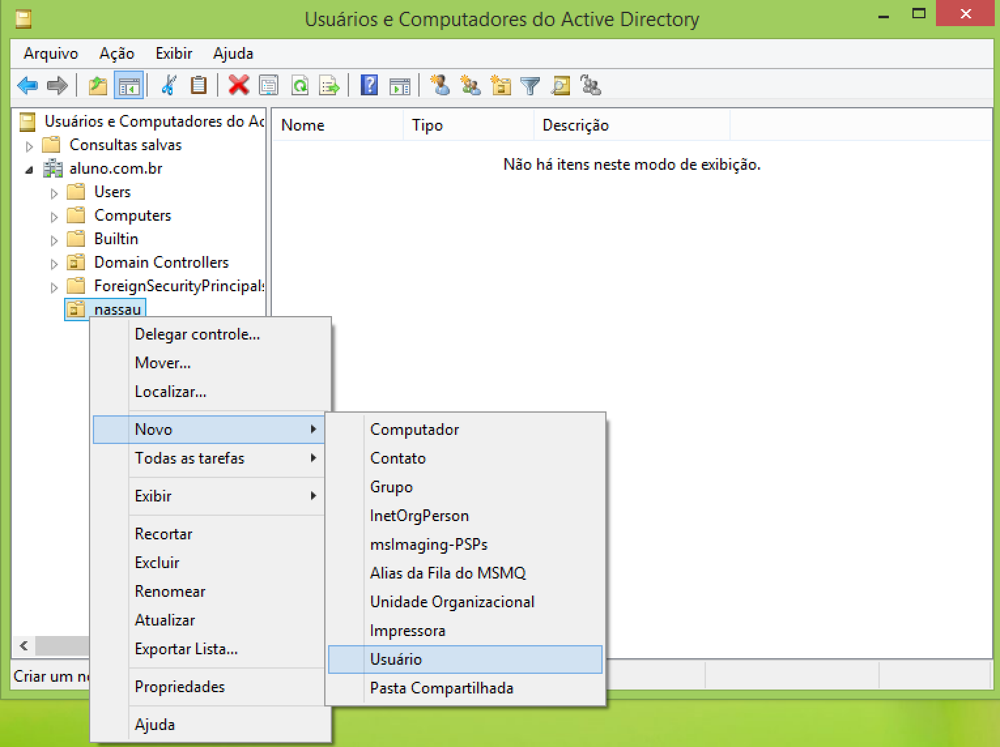
<h4 align="middle">Figura 21 - Menu Usuário</h4>

Na janela de cadastro do usário, preencha os campos de nome e usuário, conforme Fig. 22. Para cadastrar um usuário no domínio, devemos clicar com o botão direito em cima da Unidade Organizacional nassau e no menu suspenso selecionar Novo => Usuário.

<h4 align="middle">Figura 22 - Cadastro Usuário</h4>

Com o objetivo de implementar algumas restrições no sistema operacional dos usuários, devemos criar as Group Police-GPO, as mesmas possuem diversas implementações para personalização dos sistemas operacionais que fazem parte do domínio, como restrição ao painel de controle e configuração de rede. É importante pontuar que tal configuração é idêntica no Windows Server, todavia a possibilidade desta implementação no samba só veio a partir da versão 4.

Para configurarmos uma GPO devemos acessar o menu de Ferramentas Administrativas e Gerenciamento de Políticas de Grupo (Fig. 23):

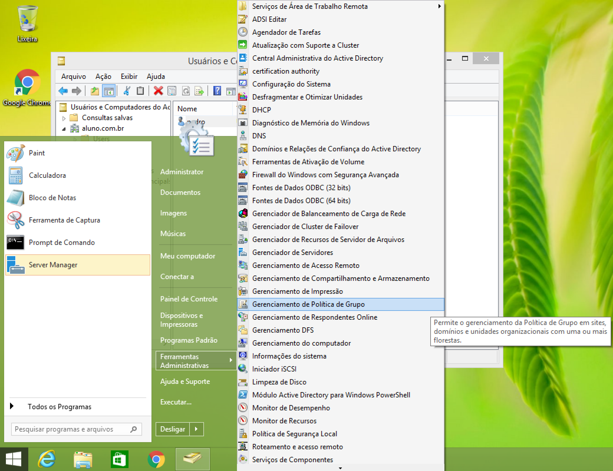
<h4 align="middle">Figura 23 - Cadastro Usuário</h4>

Na criação da GPO devemos escolher o domínio (aluno.com.br), clicar com o botão direito em cima da OU nassau e no menu suspenso selecionar criar uma GPO neste domínio e atribur um nome para ela (Fig. 24).

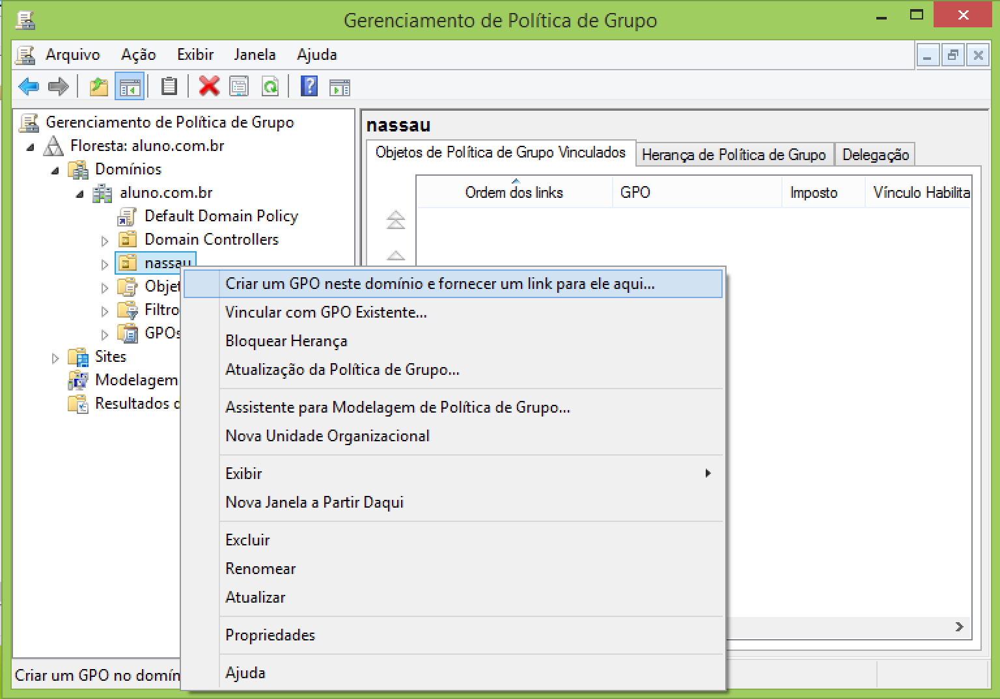
<h4 align="middle">Figura 24 - Criação GPO</h4>

Devemos editar a GPO criada, clicando com o botão direito em cima dela e nome menu suspenso selecionar a opção Editar, Fig. 25.

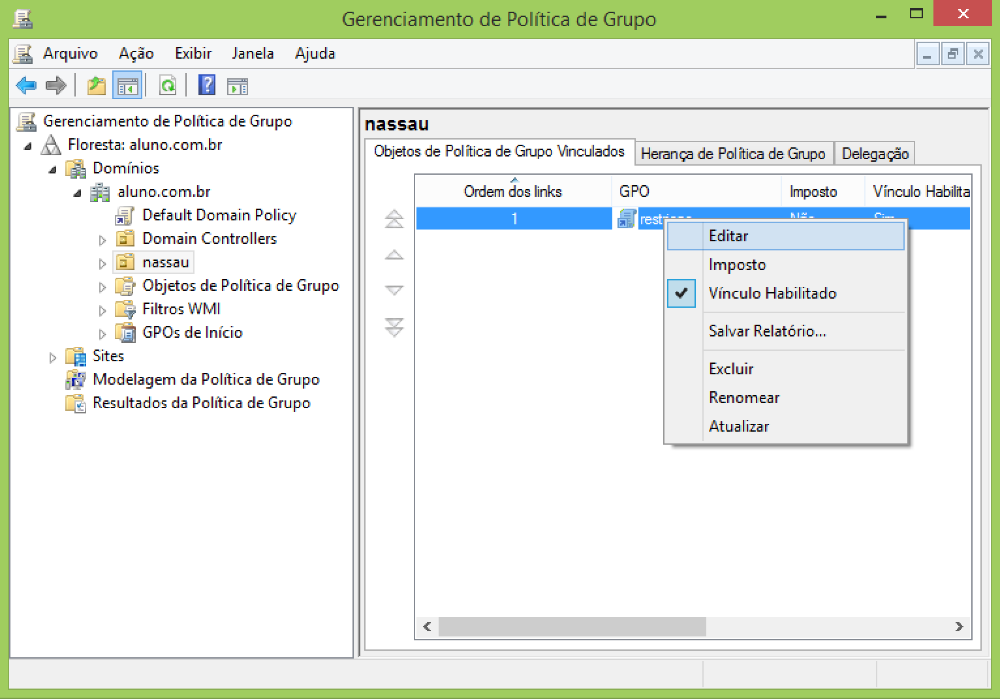
<h4 align="middle">Figura 25 - Edição GPO</h4>

Iremos implementar uma restrição para os usuários da OU nassau, no qual os mesmos serão impossibilitados de realizar alterações na configuração avançada TCP/IP. Para isso, selecione configuração do usuário => Modelos Administrativos => Rede => Conexões de Rede e edite a opção do lado direito da janela <b>Proibir a configuração avançada do TCP/IP</b>, selecione opção habilitado, conforme Fig. 26:

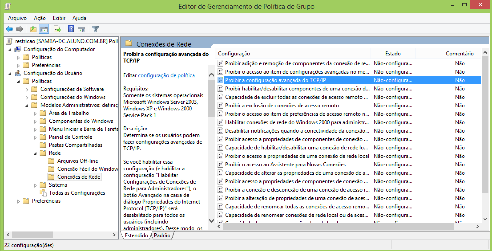
<h4 align="middle">Figura 26 - GPO Configuração de Rede</h4>

Ainda como exemplo, iremos ocultar a opção Adicionar ou Remover pogramas do Painel de Controle dos usuários da OU nassau. Para isso selecione configuração do usuário =>Adicionar ou Remover Programas e edite a opção do lado direito da janela <b>Remover opção Adicionar/Remover Programas</b>, selecione opção habilitado (Fig. 27).

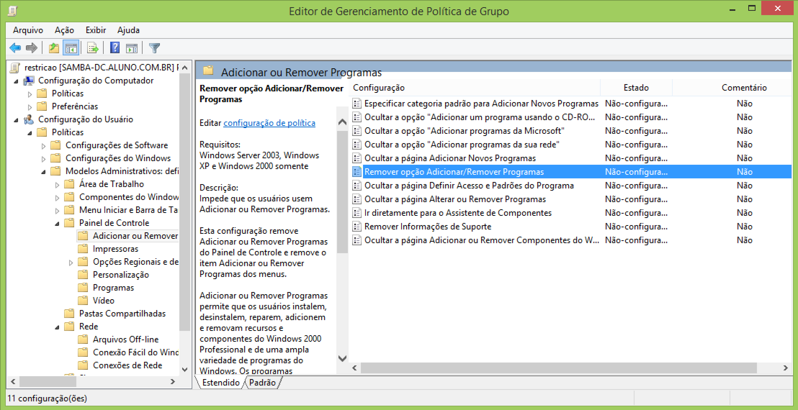
<h4 align="middle">Figura 27 - GPO Painel de Controle</h4>

## CONFIGURAÇÃO DO CLIENTE

Para testarmos a configuração do usuário, iremos utilizar o host Cliente-PC (Fig. 01). Devemos ingressar o mesmo no domínio, conforme abordado anteriormente, e logar com o usuário <b>pedro</b>.

Ao tentarmos acessar as configurações de rede será apresentado uma tela de autenticação (Fig. 28). Considerando que o usuário <b>pedro</b> não tem permissão de acesso a estas configurações de rede

<h4 align="middle">Figura 28 - Configurações de Rede</h4>

Ao abrirmos o painel de controle, em adicionar ou remover programas, podemos observar que não existe opção para remover nenhum programa do sistema operacional, conforme mostra a Fig. 29.

<h4 align="middle">Figura 29 - Painel de Controle</h4>

